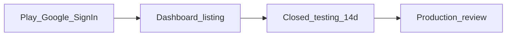

# RiderLab → Google Play Production

Operator runbook. Use with [PLAY_STORE.md](PLAY_STORE.md) and [STORE_READINESS.md](STORE_READINESS.md).

**Package:** `com.rawthrottle.riderlab`  
**Cloud project:** `riderlab-7b183`  
**Current Play binary:** `1.37.4+79` (play flavor AAB)

Play Console URLs (paste as-is):

| Field | URL |
|---|---|
| Website | https://riderlab.rawthrottle.com.mx/ |
| Privacy policy | https://riderlab.rawthrottle.com.mx/legal/privacy.html |
| Terms | https://riderlab.rawthrottle.com.mx/legal/terms.html |

Store art (upload these): [docs/store/play/](store/play/) — `icon-512.png`, `feature-graphic-1024x500.png`, `phone-01-home.png` … `phone-05-full-map.png`.

Personal Play accounts generally cannot ship Production until **Closed testing is live 14 days with ≥12 opted-in testers**. Internal testing does not start that clock.



---

## 0. Play Google Sign-In (must work before Production)

Play re-signs the AAB (quantum-ready: **three** keys). Credential Manager `[16] Account reauth failed` means an Android OAuth client is missing the SHA-1 of the cert **on the device**.

The app already: signs out before native Google; on `[16]` opens **browser OAuth** (`com.rawthrottle.riderlab://login-callback`). Native still needs the clients below so the account picker can succeed.

### 0.1 Copy SHA-1s from Play

Play Console → RiderLab → **Protected with Play** → **Play Store protection** → **Manage Play app signing**.

Create **one Android OAuth client per distinct SHA-1** (same package). Typical set:

| Client name | SHA-1 source |
|---|---|
| `RiderLab Play previous` | **Previous app signing keys** (23 Aug 2026 row) — phones on Android 16 and below |
| `RiderLab Play classical` | App signing key → **Classical** (in use) |
| `RiderLab Play PQC` | App signing key → **Post-quantum** (in use) |
| `RiderLab upload` | **Upload key certificate** (sideload APK only) |

If **Download certificates** is available, register every SHA-1 in the zip (including deployment cert).

### 0.2 Google Cloud (project `riderlab-7b183`)

[Credentials](https://console.cloud.google.com/apis/credentials?project=riderlab-7b183)

1. Keep **RiderLab Web** (`794087636174-tcia…`). That ID stays in `.env` as `GOOGLE_WEB_CLIENT_ID`. Do not use `rawthrottle-admin`.
2. **Create credentials** → **OAuth client ID** → **Android** → package `com.rawthrottle.riderlab` → paste SHA-1. Repeat for each row in the table.
3. You must see **Android** rows, not only Web / iOS.
4. [OAuth audience](https://console.cloud.google.com/auth/audience?project=riderlab-7b183) → **Testing** → **Test users** → add every Gmail that will tap Sign in with Google.

### 0.3 Firebase

Firebase → `riderlab-7b183` → Project settings → Android `com.rawthrottle.riderlab` → **Add fingerprint** for each SHA-1 **and** SHA-256 (Classical, PQC, Previous, upload).

### 0.4 Supabase

Auth → URL configuration → Redirect URLs include `com.rawthrottle.riderlab://login-callback`.  
Auth → Providers → Google: enabled, **Web** client ID + secret, Manual linking.

### 0.5 Verify on a Play install

1. Wait ~10 minutes after saving clients.
2. Uninstall RiderLab. Install **1.37.4** from Internal testing.
3. Settings → Sign in with Google.
4. Native picker should work. If `[16]` still appears, the **browser** sheet should complete sign-in.

Do not submit Production until this works on a Play-signed install.

---

## 1. Play Dashboard / listing (copy-paste)

Work top to bottom until the dashboard banner **Finish setting up your app** is gone.

### Dashboard wizard (11 items)

Open each row in order. Privacy policy is already done.

| # | Row | Answer |
|---|---|---|
| 1 | Set privacy policy | `https://riderlab.rawthrottle.com.mx/legal/privacy.html` — **done** |
| 2 | Sign in details | **Account required** (no guest). Prefer the **email/password** review user (below). |
| 3 | Ads | **No** — app does not contain ads |
| 4 | Content rating | IARC questionnaire → **18+** because of motor vehicles. No violence / social for kids. |
| 5 | Target audience | **18 and over**. Not designed for children. Do not appeal to kids. |
| 6 | Data safety | Table below. **Contains ads: No**. Users can request deletion. |
| 7 | Government apps | **No** |
| 8 | Financial features | **No** (no Play Billing / bank / crypto / lending) |
| 9 | Health | **No** — motorcycle GPS / lean lab, not a health or medical app |
| 10 | Category + contact | Category **Maps & Navigation**. Email: the address you monitor. Website: `https://riderlab.rawthrottle.com.mx/` |
| 11 | Store listing | Copy under **Store listing** below. Art in `docs/store/play/` |

**Sign in details** (row 2) — choose *All or some functionality is restricted* (the whole app is behind sign-in), then:

```
The first screen is sign-in. There is no guest mode.

To review the app:
1. Enter the email and password in this form
2. Tap Sign in with email
3. Recording, map, lean lab, Friends, and Rodadas work after sign-in

Google Sign-In is optional. Email/password is enough for review.
```

**Name:** `RiderLab review account`  
**Username:** the email you created in Supabase → Authentication → Users (auto-confirm).  
**Password:** that user’s password (Play Console only — not in git).

You can still mention Google as optional in “Any other information”:

```
Google Sign-In is optional. Email/password is enough for review.
```

### Store listing

- **App name:** RiderLab  
- **Short description (80 chars):**  
  `GPS line, lean lab, and group rides for motorcyclists.`
- **Full description:**

```
RiderLab records your motorcycle GPS line and lean so you can review corners after the ride — not while you are riding.

• Ride with the phone in a pocket; a persistent notification stays on while recording
• Ride Lab: map, lean, brakes, and coaching on the line you actually took
• Rodadas: invite friends, share a route, ride together
• Google or email account required to use the app and sync rides

Do not interact with the phone while riding. Analysis is for after you stop.

Privacy: https://riderlab.rawthrottle.com.mx/legal/privacy.html
```

- **Spanish short (optional):** `Línea GPS, lab de inclinación y rodadas para motociclistas.`
- **Category:** Maps & Navigation (or Sports / Health & fitness)  
- **Tags:** motorcycle, GPS, riding  
- **Email:** your Play developer email  
- **Website:** `https://riderlab.rawthrottle.com.mx/`  
- **Privacy policy:** `https://riderlab.rawthrottle.com.mx/legal/privacy.html`  
- **Graphics:** upload files in `docs/store/play/`

### Content rating / audience

- IARC questionnaire: **18+** (motor vehicles). No user-generated social for kids.  
- Target age: **18 and over**. Not designed for children.

### Data safety (answers)

| Data type | Collected? | Shared? | Required? | Purpose |
|---|---|---|---|---|
| Precise location | Yes | Yes (your backend / Supabase when the user syncs) | Yes for recording a ride | App functionality |
| Location, background | Yes, only during an active ride | Same | Yes for pocket / screen-off recording | App functionality |
| Name / email | Yes (Google or email sign-in) | Yes (auth provider + profile) | Yes (account required) | Account |
| Photos | Yes if they add rodada photos | Yes if they share the rodada | Optional | App functionality |
| App activity | Optional diagnostics | With infrastructure only | No | Analytics / crash (if you enable) |
| Sold? | Never | | | |

- **Ephemeral:** No  
- **Encrypted in transit:** Yes  
- **Users can request deletion:** Yes (privacy policy)  
- **Contains ads:** **No** (Free upsell is in-app, not an ads SDK)  
- **In-app purchases:** No until RevenueCat / Play Billing is live  

### Background location declaration

**Short:** Continue recording the motorcycle GPS line with the screen locked or the phone in a pocket while riding.

**Long:** RiderLab’s core feature is an accurate post-ride map of the line taken. Riders cannot safely hold or glance at the phone. Background location (Android foreground service) keeps sampling GPS/IMU after the screen turns off until the rider ends the ride. A persistent notification is shown. Location is not used for ads or tracking outside an active ride or an opt-in rodada.

### Other policy forms

- News app / COVID / government: **No** unless they apply.  
- Countries: those you sell in. Price: **Free**.

---

## 2. Closed testing (starts the 14-day clock)

Internal testing ≠ closed testing.

1. Play Console → **Test and release** → **Testing** → **Closed testing**.
2. Create a track if needed → **Create new release**.
3. Add the **same** Play AAB that has working Google Sign-In (do not add features).
4. **Testers** → email list of **12+ Gmails**.
5. Copy **opt-in link**. Each tester must open it, tap **Become a tester**, then install from Play.
6. Confirm **≥12 opted in** (not just invited).
7. Note the date the track went live. Production stays locked until **14 days** after that (personal accounts).

Use the two weeks for Sign-In + ride-record checks, not idle wait.

---

## 3. Production submit

When dashboard is 100% and closed-test eligibility is met:

1. **Test and release** → **Production** → **Create new release**.
2. Add from library the **same** closed-test AAB (no extra native features).
3. Release name: `RiderLab 1.37.4`.
4. Review notes for Google:

```
Motorcycle GPS line recorder. An account (Google or email/password) is required. Background location is only used during an active ride with a visible foreground-service notification (phone in pocket / screen off). Users are instructed not to interact with the phone while riding.
```

5. **Start rollout to Production** (100% or staged 20% if you prefer).  
6. Wait for review (often 1–7 days).

Do **not** promote to Production if Play Google Sign-In still fails.

---

## 4. What is not on this path

- App Store / TestFlight  
- RevenueCat **paid** Pro (Play IAP). Product matrix, no-card trial, and partner codes: [FREE_VS_PRO.md](FREE_VS_PRO.md). Keep this Play listing **Price: Free** and **In-app purchases: No** until that contract’s store packages are wired.  
- GitHub Action `play-release` (optional later; does not shorten the 14-day closed test)

Support email on the listing: use the address you monitor.
