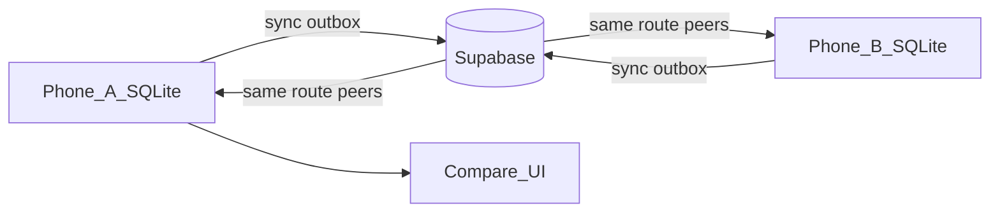

# RiderLab — product requirements

Living requirements for features beyond the current MVP. Status: **Planned** unless noted.

Related shipped MVP: GPS ride recorder, Ride Lab (map + scrubber + charts), in-app GitHub APK updates. See root [README](../README.md).

---

## 1. Unified speed color scale

**Goal:** Every speed visualization uses one shared color mapping so riders can read speed at a glance across map and charts.

### Scale

| Speed (km/h) | Color |
|---|---|
| **0** | Electric blue |
| **~25** | Mint |
| **~45** | Lime |
| **~65** | Yellow |
| **~90** | Orange |
| **~130** | Hot red |
| **250** | Magenta |

- High-contrast **multi-hue** ramp (not a single red family) so slow vs fast is obvious on the map and charts.
- **Street-biased:** yellow/orange/red arrive at everyday speeds so regular riders already look “a little quick.”
- Cap: **250 km/h**.
- Same mapping for map polyline, speed chart, legend.

### Brake inference (from speed)

- Detect brake pulses from GPS Δv/Δt (no brake sensor).
- Hardness bands: light / medium / hard from peak deceleration (m/s²).
- Show map markers + Ride Lab list with speed drop and peak m/s².

### Out of scope (for this requirement)

- Recoloring non-speed charts (GPS accuracy, etc.).
- Changing brand UI chrome (buttons, banners) to match the speed blues.

### Acceptance criteria

- [ ] One shared helper (e.g. `speedColor(kmh)`) used by map + speed chart.
- [ ] Warm hues by street speeds: yellow ~65, orange ~90, red ~130.
- [ ] Smooth multi-hue gradient across the ramp; cap at 250 km/h (magenta).
- [ ] Legend visible on the pilot-line map screen.

---

## 2. Lean / inclination color language (L vs R)

**Goal:** Left and right lean always use a fixed, distinct pair of colors that are **not green and not red** (red is reserved for over-300 speed; green is easy to confuse with “good” and with older map bands).

### Locked meaning

| Side | Meaning | Color role |
|---|---|---|
| **L / Left** | Negative lean (current convention) | **Cyan / sky** (`leanLeft`) |
| **R / Right** | Positive lean | **Amber / gold** (`leanRight`) |
| Upright (~0°) | Neutral | Mist / steel (no strong side tint) |

Suggested tokens (implement in `AppTheme` or a viz palette):

- `leanLeft` ≈ `#4CC9F0` (cyan)
- `leanRight` ≈ `#F4A261` (amber)

Avoid for lean: traffic green, and the speed red ramp (so speed vs lean stay distinguishable).

### Apply everywhere inclination is shown

- Motorcycle lean gauge (needle, peak L/R labels)
- Lean left/right profile chart (split color by sign, or dual-tone fill)
- Any future corner cards or comparison views that call out max lean L/R

### Acceptance criteria

- [ ] Gauge, chart, and peaks share the same L/R tokens.
- [ ] No green or red used to mean lean side.
- [ ] Speed red (>300) never appears as “right lean.”

---

## 3. Loop mode (auto lap recording)

**Goal:** Rider defines a closed circuit once; the app then records **each lap** automatically while they keep riding.

### Rider flow

1. Rider enters **Loop mode** (from home or active-ride entry).
2. **Loop init** — mark the start of the reference segment (GPS + time).
3. Rider rides the circuit once (or as needed) to teach the path.
4. **Loop end** — mark the end of the reference loop (closes the geometric / path definition).
5. App arms **auto lap detection**: each time the rider re-enters the init zone with a plausible loop completion, start a new lap segment (and close the previous one).
6. Rider stops loop session when done → review per-lap metrics.

### Product rules

- Loop definition is tied to a **route/circuit** (see also §4).
- Init/end markers should be forgiving (geofence / corridor radius), not a single GPS point.
- Manual **force lap** optional later; MVP is auto after init+end.
- Safety: no interactive map required while moving; marking init/end can be large buttons on the active HUD.
- Persist: loop session → many lap rides (or one ride with lap segments) in SQLite.

### Metrics per lap (minimum)

- Lap time, distance, max/avg speed, max lean L/R, GPS quality summary.

### Acceptance criteria

- [x] User can set Loop init and Loop end.
- [x] After both are set, subsequent passes create new lap records without tapping start each time.
- [x] Session end stops auto recording.
- [x] Rider can open a lap and see Ride Lab for that lap.

---

## 4. Compare rides on the same route (incl. other riders)

**Goal:** Compare metrics across different rides (or laps) that share the **same route** — your own history first, then **other users** when cloud sync is on.

### Where data lives today (MVP)

| Layer | Location | Scope |
|---|---|---|
| Local DB | SQLite file `motoline.db` on the phone (`path_provider` app documents dir) | **This device only** |
| Tables | `rides`, `track_points` | GPS + lean samples for rides you recorded |
| Cloud | None yet | No accounts, no shared routes |

So right now you **cannot** see another rider’s data — it never leaves their phone.

### Target architecture (multi-user compare)

| Layer | Choice | Role |
|---|---|---|
| Device | Keep SQLite offline-first | Record outdoors with no signal |
| Cloud | **Supabase** (Auth + Postgres + Storage) — already in architecture plan | Store rides/routes from many users; RLS for private vs shared |
| Route | Named route / loop definition (+ optional spatial match later) | Decide “same route” |
| Compare UI | Side-by-side metrics + optional line overlay | Your ride vs peers (or vs your own best) |

### Privacy / sharing (product rules)

- **Closed beta (current):** every authenticated app user appears on every other user’s friend list. Rides can be shared with a toggle (default on). Named **routes/circuits** can be created, shared, and used to tag rides for peer compare.
- Compare peers via **same `route_id`** and/or **overlapping bbox**.
- Later (open release): invite/friend graph instead of “everyone is friends.”

### Route identity (MVP approach)

- **Closed-beta peer match:** bounding-box overlap (with pad) on shared rides — no named route required.
- Later: explicit `route_id` / loop tagging (§3); optional polyline similarity.

### Compare experience

- Pick a **baseline** ride/lap and one or more **challengers** on the same route (self or shared peers).
- Side-by-side (or overlay) metrics:
  - Total / sector time (full lap first; sectors later)
  - Max / avg speed
  - Max lean L / R
  - Line quality score (existing Ride Lab score when available)
- Optional map overlay: two polylines with shared playhead time-normalized or distance-normalized.
- Use §1 speed colors and §2 lean colors so overlays stay consistent.

### Acceptance criteria

- [x] User can select ≥2 rides/laps that share a route and open Compare (local first).
- [x] Key metrics shown in one comparison view.
- [x] Clear empty states when no same-route peers exist.
- [ ] Cloud: authenticated sync of ride summaries + track (chunked).
- [ ] Cloud: fetch shared peers for a route and compare against them.

### Build order for this requirement

1. **Local same-route compare** (your rides only) — needs route/loop tagging (§3).
2. **Supabase Auth + ride sync** — upload after ride ends; pull your history to a new phone.
3. **Shared routes + peer compare** — opt-in share flag; compare UI loads peer summaries.

---

## 5. Segment select / zoom (road piece)

**Goal:** Pick a contiguous stretch of the pilot line, zoom the map into it, and see metrics for **only that piece**.

### Rider flow

1. In Ride Lab, open **Segment**.
2. Drag start / end on a range slider (time along the ride).
3. **Zoom to segment** — map fits that stretch; charts + stats recompute for the window.
4. Scrub playhead inside the segment only.
5. **Full ride** clears the window.

### Metrics (segment-scoped)

- Duration, distance, max / avg moving speed
- Max lean L / R (same cyan/amber language)
- Point count / GPS quality summary
- Line score for the window (optional; same formula on window samples)

### Acceptance criteria

- [ ] Range start/end selectable on completed rides with ≥2 points
- [ ] Map zooms / focuses on the selected stretch (outside dimmed or hidden)
- [ ] Metric cards + speed/lean charts reflect the segment only
- [ ] Clear returns to full-ride view

---

## 6. Recta vs curva

**Goal:** Split the pilot line into **rectas** (straights) and **curvas** (turns), with optional izquierda/derecha.

### Signals

- Primary: GPS heading / bearing change along the path
- Soft vote: lean L/R for turn side
- Merge tiny scraps into neighboring stretches

### UI

- Collapsible Ride Lab section **Rectas y curvas**
- Tap a **curva** → detail screen: zoomed map with E / A / S markers + entrada / ápice / salida speeds, lean, deltas
- Tap a **recta** → jump playhead

### Acceptance criteria

- [x] Detect stretches with Spanish labels (Recta / Curva / Curva izquierda|derecha)
- [x] List in Ride Lab with distance + duration
- [x] Curva detail: zoomed map + entrada / ápice / salida
- [ ] Optional snapshot/picture export of curva (later)

---

## Implementation order (suggested)

1. **Speed + lean color systems** — shared viz palette; retrofit map + charts + gauge (small, high polish).
2. **Loop mode** — recording model + HUD markers + lap list.
3. **Same-route compare** — builds on loop/route identity; then generalize to any tagged route.

---

## Open decisions

| Topic | Default for now | Revisit when |
|---|---|---|
| Speed ramp stops (street-biased) | Yellow ~65 / orange ~90 / red ~130 / magenta 250 | Outdoor feedback |
| Behavior at / above speedCapKmh | Clamp to magenta end stop | Edge cases |
| Lap storage model | Segments under one session vs separate rides | Loop mode design spike |
| Route matching without loops | Deferred | After loop tagging ships |

---

## Traceability

| ID | Title | Status |
|---|---|---|
| REQ-SPEED-COLOR | Unified speed color scale (pale→dark red by speed) | In progress (map + speed chart + legend) |
| REQ-LEAN-COLOR | Lean L/R colors (not green/red) | In progress (gauge + lean chart) |
| REQ-LOOP | Loop mode init/end + auto laps | In progress (recorder + HUD shipped; needs field testing) |
| REQ-COMPARE | Compare metrics on same route (local then multi-user via Supabase) | Local done; cloud peer path exists |
| REQ-SYNC | Supabase RiderLab project + schema + Flutter client bootstrap | In progress |
| REQ-SEGMENT | Select/zoom road segment + segment metrics | In progress |
| REQ-ROAD-KIND | Recta vs curva from heading (+ lean side) | In progress |

### Brand typography & chrome

- Wordmark: `RiderLabMark` — **Barlow Condensed** uppercase lockup `RIDER` + `LAB` (race-decal tracking); `LAB` uses throttle brand orange.
- Accent bar: signal → amber → mint gradient under hero/title marks.
- UI titles / buttons: **Exo 2**; body / captions often **Rajdhani** (via `AppFonts` + theme).
- Chrome palette: carbon asphalt, hot signal CTA, electric mint telemetry, race amber peaks.
